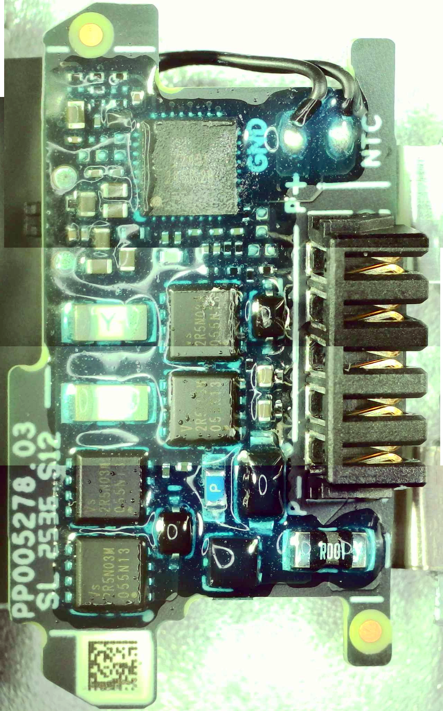

# Dji Neo2_battery
Reverse engineering of dji Neo 2 battery

# IC founded:
*	4× VS 2R5N03M: sezione di switching/protezione della batteria.
*	Z2401 2451S28: probabile main chip
*	QFN-32 sul retro: IC di gestione/controllo.

# Pin Out:
(- - D + +)

# Battery:
* 2x Ampace HKA530CG03C1 1.606aH 3,7v
* (55 x 30 x 0,55 mm) ±

